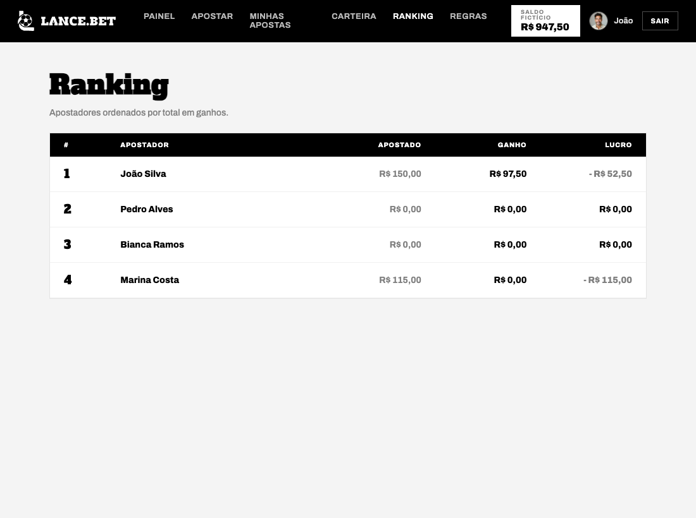
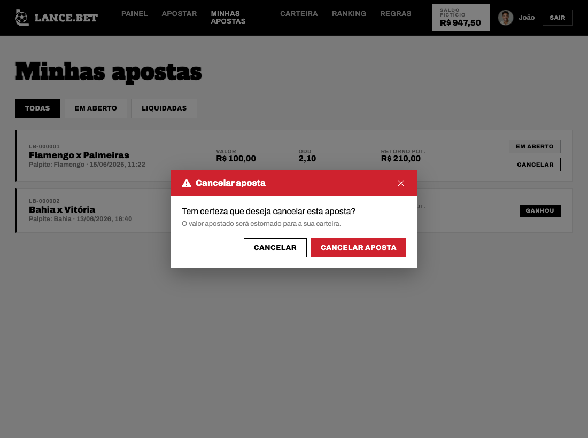
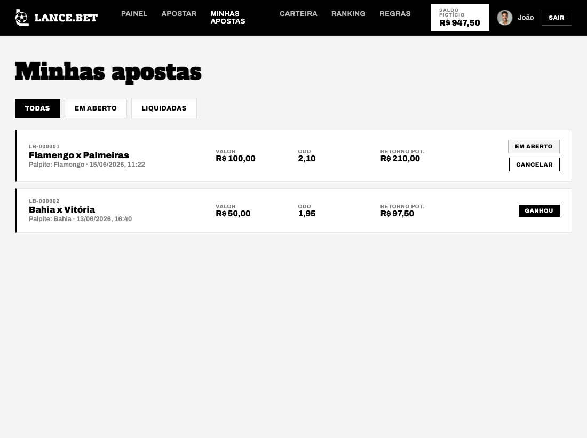
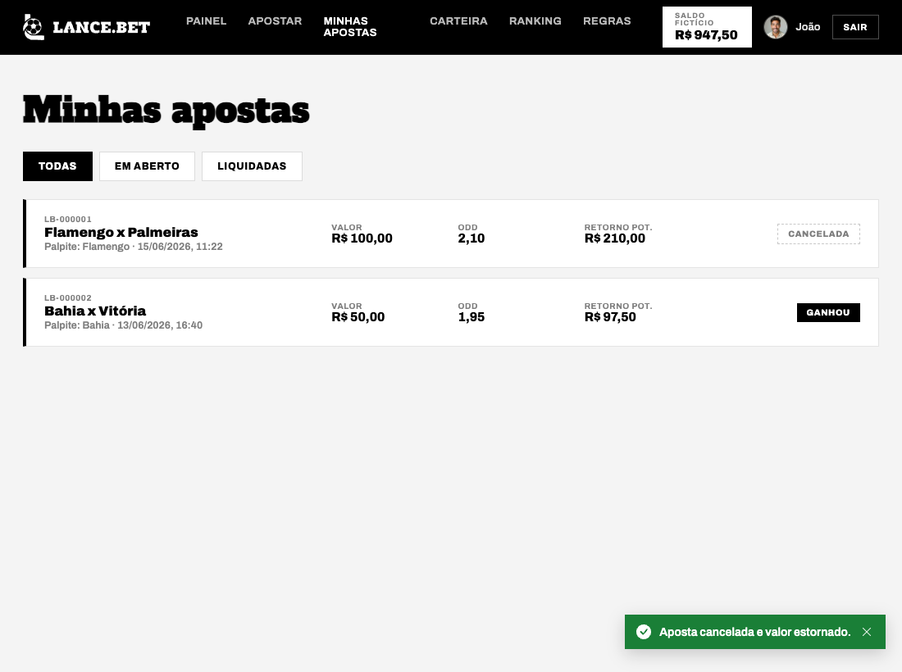
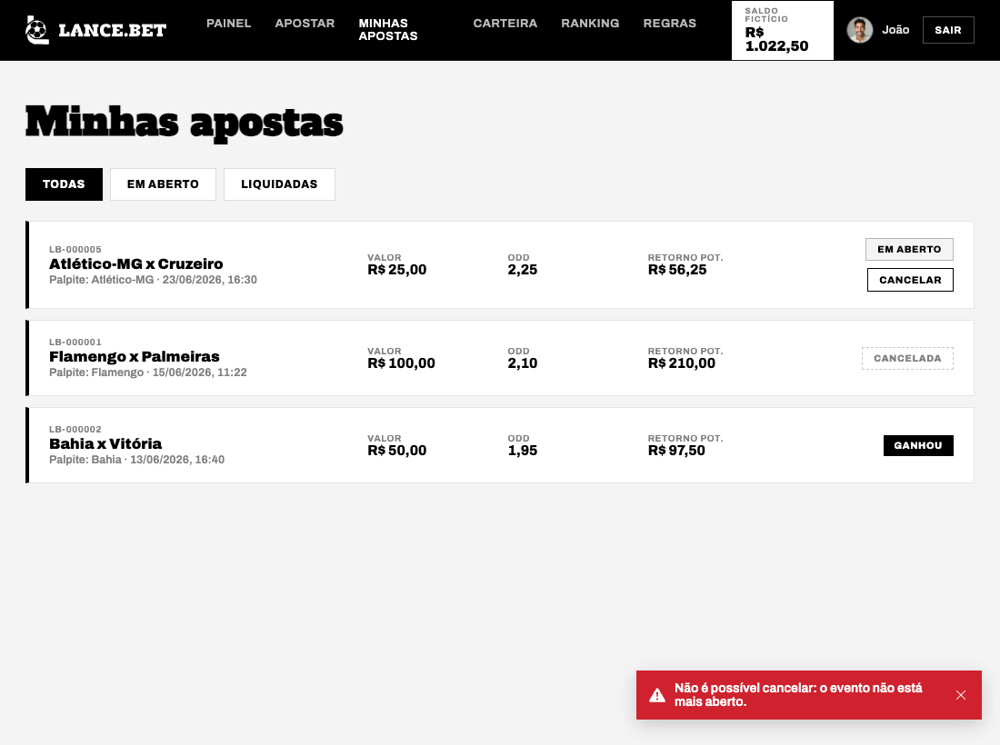

# Tutorial Passo a Passo — Ranking de apostadores + Cancelar aposta com estorno

Bem-vindo. Este é um tutorial **bem detalhado**, feito para quem está começando. Vamos com calma, um passo de cada vez. Se você seguir **exatamente** o que está escrito aqui, copiando os códigos no lugar certo, as duas funcionalidades vão funcionar.

> Dica de ouro: leia o passo inteiro **antes** de começar a digitar. E nunca pule a parte de "registrar" (deixar o sistema enxergar a tabela nova e a rota nova) — é onde quase todo mundo erra.

---

## Setup — preparando o computador do zero

Antes de mexer em qualquer código, você precisa deixar o ambiente pronto. Esta seção parte do zero: instala os programas, baixa o projeto, prepara o backend e o frontend, e cria um lugar seguro para você trabalhar. Faça na ordem.

> Para entender os nomes: **backend** é a parte que roda no servidor (o "cérebro", em Python, que conversa com o banco de dados). **Frontend** é a parte que aparece no navegador (as telas, feitas com React/TypeScript). Neste projeto eles ficam em duas pastas: `backend/` e `frontend/`.

### Passo 0.1 — Instalar os programas

Você vai precisar de quatro programas. Instale cada um e depois confira se ele ficou disponível no terminal.

1. **Git** — o programa que baixa o projeto do GitHub e guarda o histórico das suas mudanças. Baixe em https://git-scm.com/downloads.
2. **Python 3.11 ou mais novo** — a linguagem do backend. Baixe em https://www.python.org/downloads/. No Windows, marque a caixa **"Add Python to PATH"** durante a instalação (sem isso, o terminal não acha o Python).
   > Atenção importante: o projeto tem um arquivo chamado `.python-version` que pede a versão `3.14`. Essa versão é muito nova e talvez nem exista no seu computador. **Não tem problema** — o projeto roda bem em qualquer Python de 3.11 a 3.13. Logo abaixo você vai aprender a criar o ambiente com o Python que você tem.
3. **Bun** — o programa que instala e roda as bibliotecas do frontend. É o substituto moderno do npm e é o oficial deste projeto. Instale seguindo https://bun.sh.
4. **VSCode** — o editor de código onde você vai escrever tudo. Baixe em https://code.visualstudio.com.

Depois de instalar, abra um terminal e confira cada um. Se aparecer um número de versão, deu certo:

```bash
git --version
python --version
bun --version
```

> Por que conferir? Porque metade dos problemas de "não funciona" é o programa que não foi instalado direito ou o terminal que não enxerga ele. Conferir agora economiza dor de cabeça depois. Se `python --version` mostrar uma versão menor que 3.11, instale uma mais nova. Em alguns sistemas o comando é `python3` no lugar de `python`.

### Passo 0.2 — Baixar (clonar) o projeto

"Clonar" é o termo do Git para baixar uma cópia completa do projeto, com todo o histórico. Escolha uma pasta onde você guarda seus projetos e rode:

```bash
git clone https://github.com/guilhermesantosdias237-cloud/lancebet.git
cd lancebet
```

Agora você está dentro da pasta `lancebet/`, que tem (entre outras) as pastas `backend/` e `frontend/`.

### Passo 0.3 — Preparar o backend (ambiente e bibliotecas)

O backend usa um **ambiente virtual** (apelidado de `.venv`). Pense nele como uma caixa isolada só para este projeto: as bibliotecas Python ficam guardadas ali dentro, sem bagunçar o resto do seu computador nem outros projetos.

A partir da pasta `backend/`, crie o ambiente virtual usando o Python 3.11 (ou a versão que você instalou):

```bash
cd backend
python -m venv .venv
```

> Se o seu sistema tiver várias versões de Python e você quiser forçar a 3.11, use `python3.11 -m venv .venv`. Isso garante que a caixa isolada use exatamente o Python que funciona, ignorando o `3.14` pedido pelo `.python-version`.

Agora **ative** o ambiente (ativar = dizer ao terminal "use o Python e as bibliotecas de dentro desta caixa"):

```bash
# Linux ou Mac:
source .venv/bin/activate

# Windows (PowerShell):
.venv\Scripts\Activate.ps1
```

Quando ativado, aparece `(.venv)` no começo da linha do terminal. Com o ambiente ativo, instale as bibliotecas que o projeto precisa (elas estão listadas no arquivo `requirements.txt`):

```bash
pip install -r requirements.txt
```

Por fim, crie o arquivo de configuração `.env` (ele guarda senhas, porta e outros ajustes) copiando o modelo pronto:

```bash
# Linux ou Mac:
cp .env.example .env

# Windows (PowerShell):
copy .env.example .env
```

> Por que copiar em vez de criar do zero? Porque o `.env.example` já vem com tudo preenchido para desenvolvimento. Para rodar local você não precisa editar nada — só ter o arquivo.

### Passo 0.4 — Preparar o frontend (bibliotecas)

O frontend tem as próprias bibliotecas (React, etc.). Quem instala elas é o **Bun**. A partir da pasta `frontend/`:

```bash
cd frontend
bun install
```

> Importante: o gerenciador oficial deste projeto é o **Bun**, não o npm. Sempre que vir um comando começando com `npm` por aí, troque pelo equivalente em `bun` (por exemplo, `npm run dev` vira `bun run dev`). Misturar npm e Bun no mesmo projeto costuma dar conflito.

### Passo 0.5 — Rodar os dois servidores

O LanceBet precisa do backend e do frontend rodando **ao mesmo tempo**, cada um no seu terminal.

Terminal 1 — backend (a partir da pasta `backend/`, com o `.venv` ativado):

```bash
.venv/bin/python main.py
```

Terminal 2 — frontend (a partir da pasta `frontend/`):

```bash
bun run dev
```

- O backend sobe na porta definida em `backend/.env` (padrão `8413`). A documentação interativa fica em `http://localhost:8413/docs`.
- O frontend (Vite) sobe em `http://localhost:5183`. Ele faz **proxy** de `/api` para o backend — ou seja, repassa por baixo dos panos toda chamada que começa com `/api`. Por isso, no navegador, você acessa só o endereço do frontend.

### Passo 0.6 — Criar uma branch para o seu trabalho

Antes de escrever a primeira linha, crie uma **branch**. Uma branch é uma linha do tempo paralela do código: você mexe à vontade nela sem tocar na versão principal (`main`). Se algo der errado, é fácil voltar atrás, e ninguém atrapalha o trabalho de outra pessoa.

A partir da raiz do projeto:

```bash
git checkout -b minha-feature
```

> Por que trabalhar em branch? Porque mantém a versão principal sempre funcionando. Você experimenta na sua branch e só junta de volta quando tiver certeza de que está tudo certo. É a forma profissional de trabalhar em equipe — e também te protege de bagunçar o seu próprio código.

### Passo 0.7 — Extensões do VSCode

Extensões são complementos que deixam o editor mais esperto (autocompletar, apontar erros, etc.). Abra o VSCode, vá no ícone de **Extensions** (quadradinhos na barra lateral) e instale:

- **Python** — suporte básico à linguagem Python (rodar, depurar, escolher o interpretador).
- **Pylance** — autocompletar inteligente e checagem de tipos do Python enquanto você digita.
- **Python Debugger** — permite pausar o código e investigar passo a passo quando algo dá errado.
- **Python Environments** — ajuda a escolher e gerenciar o ambiente virtual (`.venv`) certo.
- **ESLint** — aponta erros e mau cheiro no código JavaScript/TypeScript do frontend.
- **SQLite3 Editor** — abre e enxerga o banco de dados (`.db`) direto no editor, sem outro programa.
- **vscode-icons** — coloca ícones nos arquivos para você se localizar mais rápido na árvore de pastas.
- **HTML CSS Support** — autocompletar de classes e estilos quando você mexe em HTML/CSS.

> Dica: depois de instalar a extensão Python, abra um arquivo `.py` e, no canto inferior do VSCode, escolha o interpretador que está dentro de `backend/.venv`. Assim o editor usa o mesmo Python que você preparou no Passo 0.3.

Com tudo isso pronto, você já consegue rodar o projeto e começar a implementar. Vamos ao que você vai construir.

---

## O que você vai construir

Você vai implementar **duas funcionalidades completas** (do banco de dados até a tela), seguindo a forma como o projeto LanceBet é organizado.

1. **Ranking de apostadores** — uma página que mostra uma tabela com os apostadores em ordem de quem mais ganhou. Os dados vêm de uma **consulta agregada**: uma busca no banco que, em vez de listar linha por linha, soma e resume os valores (somando ganhos e apostas de cada pessoa) usando comandos SQL como `SUM`, `CASE`, `JOIN` e `ORDER BY`. Essa busca olha tabelas que já existem (`movimentacao_financeira`, `carteira` e `usuario`). **Não criamos tabela nova** — só uma busca nova e o jeito de usá-la na tela.

2. **Cancelar aposta com estorno** — enquanto a aposta estiver **Aberta** e o evento estiver **Aberto**, o apostador pode cancelar a aposta na página "Minhas apostas". Ao cancelar, o sistema:
   - devolve (estorna) o valor da aposta para a carteira (registra uma movimentação do tipo **Estorno**);
   - muda o status da aposta para **Cancelada**;
   - faz tudo isso dentro de **uma única transação**. Transação é um pacote de operações que só vale se todas derem certo: ou tudo acontece, ou nada acontece. Assim você nunca fica com o dinheiro devolvido mas a aposta ainda "aberta", por exemplo.

Resultado final, em forma de lista:

- Uma página **/ranking** com uma tabela ordenada de apostadores (posição, nome, total apostado, total ganho, lucro).
- Um **endpoint** `GET /api/ranking` no backend. Endpoint é um "endereço" da API: uma URL que o frontend chama para pedir ou enviar dados (aqui, para pedir o ranking).
- Um botão **Cancelar** em cada aposta aberta na página **/minhas-apostas**, com **janela de confirmação** própria do projeto (nunca a caixinha `confirm()` padrão do navegador, que é feia e não dá para estilizar).
- Um endpoint `POST /api/apostas/{id}/cancelar` no backend.
- Saldo da carteira atualizado e uma linha **Estorno** no extrato da carteira.

---

## Pré-requisitos

Se você seguiu a seção **Setup** acima, já tem tudo pronto: programas instalados, projeto baixado, backend e frontend rodando em dois terminais. Aqui vão só os lembretes rápidos que você vai usar o tempo todo enquanto implementa.

### 1. Subir o backend (a partir da pasta `backend/`)

O projeto usa um ambiente virtual (`.venv`). **Sempre** use o Python de dentro dele.

```bash
# a partir da raiz do projeto lancebet/
backend/.venv/bin/python backend/main.py
```

- O backend sobe na porta definida em `backend/.env` (padrão `8413`).
- A documentação interativa fica em `http://localhost:8413/docs`.

### 2. Subir o frontend (a partir da pasta `frontend/`)

```bash
cd frontend
bun run dev
```

- O Vite sobe em `http://localhost:5183`.
- O Vite faz **proxy** de `/api` para o backend (repassa as chamadas `/api` por baixo dos panos), então no navegador você acessa só o frontend.

### 3. Usuários para testar (já vêm prontos no banco)

O projeto já cria alguns usuários de exemplo automaticamente (isso é o "seed", uma carga inicial de dados para você não começar do zero):

- **Admin:** `lancebet@ifes.site` / senha `Admin!123`
- **Apostador:** `joao@email.com` / senha `123456` (e outros apostadores de mentira)

Cada apostador novo começa com **R$ 1.000 fictícios** (dinheiro de brincadeira, só para testar).

### 4. Conferir que o código compila (frontend)

Sempre que mexer no frontend, rode:

```bash
cd frontend
npx tsc -b --noEmit
```

Isso confere se os **tipos** batem, sem gerar a versão final do site. O projeto é **TypeScript strict** (modo rigoroso): se você importar algo e não usar, ou deixar uma variável solta, o build quebra de propósito — é o jeito de pegar erro cedo. Fique atento.

---

## As camadas e a ORDEM de implementação

O LanceBet é dividido em **camadas** bem separadas — cada parte tem um trabalho só. Isso deixa o código organizado e fácil de achar. No **backend** o caminho que um pedido percorre é:

```
Rota (routes/)  ->  DTO/Response (dtos/)  ->  Repositório (repo/)  ->  SQL (sql/)  ->  Banco (SQLite)
```

No **frontend**:

```
Cliente HTTP (lib/api.ts)  ->  Tipos (lib/types.ts)  ->  Página (pages/**)  ->  Rota/Menu (router.tsx / Header.tsx)
```

No diagrama acima aparece a sigla **DTO**. DTO quer dizer "objeto de transferência de dados": é uma classe que define **o formato** dos dados que entram e saem da API (quais campos, de que tipo). Pense nele como um formulário com campos fixos — garante que backend e frontend falem a mesma língua. Os DTOs de saída (o que a API devolve) o projeto chama de **Response**.

> Outra sigla que você vai ouvir é **CRUD** — as quatro operações básicas sobre dados: **C**reate (criar), **R**ead (ler), **U**pdate (atualizar) e **D**elete (apagar). Quase todo sistema é, no fundo, um monte de CRUD.

### Por que implementar de baixo para cima?

Implementamos **de baixo (banco) para cima (tela)**. O motivo é simples: cada camada de cima **depende** da de baixo. Se você começar pela tela, vai acabar chamando funções que ainda nem existem e ficar perdido. Construindo de baixo para cima, quando você chega numa camada, tudo que ela precisa **já está pronto e dá para testar**.

A ordem que vamos seguir:

**Funcionalidade A — Ranking:**
1. SQL: a query `RANKING` em `carteira_sql.py`.
2. Repo: método `ranking()` em `carteira_repo.py`.
3. Response (DTO de saída): `RankingItemResponse`.
4. Rota: `GET /ranking` em `carteira_routes.py`.
5. Registrar a rota no `main.py` (a rota já existe num router já registrado — vamos confirmar isso).
6. Frontend: `rankingApi` em `api.ts` + tipo `RankingItem` em `types.ts`.
7. Página: `RankingPage.tsx`.
8. Registrar a página em `router.tsx` e (opcional) um link no `Header.tsx`.

**Funcionalidade B — Cancelar aposta:**
1. SQL: a query `ATUALIZAR_STATUS` em `aposta_sql.py`.
2. Repo: método `cancelar_aposta()` em `aposta_repo.py`.
3. Rota: `POST /apostas/{id}/cancelar` em `aposta_routes.py` (router já registrado).
4. Frontend: `apostasApi.cancelar` em `api.ts` + espelhar `Cancelada`/`Estorno` em `types.ts`.
5. Página: botão **Cancelar** com confirmação em `MinhasApostasPage.tsx`.

> Boa notícia sobre **registro** (registrar = avisar o sistema que aquela rota ou tabela existe, para ele passar a enxergá-la): para o Ranking vamos pendurar a rota num router (`carteira_router`) que **já está registrado** no `main.py`. Para o Cancelar, é a mesma coisa (`apostas_router`). E **nenhuma das duas funcionalidades cria tabela nova**. Mesmo assim, vamos mostrar EXATAMENTE onde o registro de tabela e de router acontece, para você entender como funciona (e saber fazer quando um dia precisar criar uma tabela de verdade).

---

# Parte A — Ranking de apostadores

## Passo A1 — SQL: a query `RANKING`

**Arquivo:** `/Volumes/Externo/Ifes/2026.1/PI20261/Projetos/lancebet/backend/sql/carteira_sql.py`
**Tipo:** EDIÇÃO (adicionar uma constante nova)

Abra o arquivo. Você vai ver que ele é só um monte de **constantes de texto** guardando comandos SQL (SQL é a linguagem para conversar com o banco de dados). Cada constante tem o nome em `MAIÚSCULA_COM_UNDERLINE`. Repare na constante `OBTER_RESUMO_CARTEIRA` que já existe — ela usa `SUM(CASE WHEN tipo = 'Aposta' ...)`. Vamos seguir **esse mesmo estilo**, para o seu código combinar com o resto.

No **final do arquivo** (depois da última constante, que é `OBTER_MOVIMENTACOES_POR_CARTEIRA`), adicione:

```python
# =============================================================================
# Ranking de apostadores
# =============================================================================

# Ranking agregado: para cada usuário apostador, soma o total apostado (débitos
# de aposta, em valor absoluto) e o total ganho (créditos de ganho) a partir das
# movimentações da carteira. O lucro é (total_ganho - total_apostado). Ordena do
# maior total ganho para o menor (empate desempata por menor total apostado). Só
# entram usuários que têm carteira.
RANKING = """
SELECT
    u.id   AS usuario_id,
    u.nome AS nome_usuario,
    COALESCE(SUM(CASE WHEN m.tipo = 'Aposta' THEN -m.valor ELSE 0 END), 0.0) AS total_apostado,
    COALESCE(SUM(CASE WHEN m.tipo = 'Ganho'  THEN  m.valor ELSE 0 END), 0.0) AS total_ganho
FROM usuario u
INNER JOIN carteira c ON c.usuario_id = u.id
LEFT JOIN movimentacao_financeira m ON m.carteira_id = c.id
WHERE u.perfil = 'Apostador'
GROUP BY u.id, u.nome
ORDER BY total_ganho DESC, total_apostado ASC
LIMIT ?
"""
```

Explicando os pontos importantes:

- `SUM(CASE WHEN m.tipo = 'Aposta' THEN -m.valor ELSE 0 END)` — soma só os débitos de aposta. O `valor` da movimentação de aposta é **negativo** (veja `criar_aposta` no repo, que grava `-valor_apostado`), por isso colocamos `-m.valor` para virar positivo.
- `SUM(CASE WHEN m.tipo = 'Ganho' THEN m.valor ELSE 0 END)` — soma os créditos de ganho (que são positivos).
- `COALESCE(..., 0.0)` — se não houver movimentação, devolve `0.0` em vez de `NULL`.
- `INNER JOIN carteira` — garante que só apostadores **com carteira** entrem.
- `LEFT JOIN movimentacao_financeira` — apostadores **sem nenhuma movimentação** ainda aparecem (com zeros).
- `WHERE u.perfil = 'Apostador'` — não queremos admins no ranking. O valor `'Apostador'` é exatamente o valor do enum `Perfil` (ver `util/perfis.py`).
- `GROUP BY u.id, u.nome` — agrupa por usuário para o `SUM` funcionar por pessoa.
- `ORDER BY total_ganho DESC, total_apostado ASC` — ordena por quem mais ganhou; empate desempata por quem apostou menos.
- `LIMIT ?` — limita a quantidade de linhas (ex.: top 50). O `?` é um espaço reservado: em vez de escrever o número direto no texto do SQL, deixamos o valor ser passado depois, separado. Isso se chama **prepared statement** (consulta preparada) e é o jeito seguro de evitar que alguém injete comando malicioso pela entrada de dados.

> Por que calcular somando as movimentações em vez de ler de uma coluna pronta? Porque o projeto **não guarda esses totais repetidos** em lugar nenhum; eles são sempre calculados a partir das movimentações na hora (o mesmo jeito que o `OBTER_RESUMO_CARTEIRA` já faz). Assim o número nunca fica desatualizado.

## Passo A2 — Repo: o método `ranking()`

**Arquivo:** `/Volumes/Externo/Ifes/2026.1/PI20261/Projetos/lancebet/backend/repo/carteira_repo.py`
**Tipo:** EDIÇÃO (importar a query nova + adicionar uma função)

### A2.1 — Importar a constante nova

No topo do arquivo existe um bloco `from sql.carteira_sql import (...)`. Adicione `RANKING` na lista de imports:

```python
from sql.carteira_sql import (
    CRIAR_TABELA_CARTEIRA,
    CRIAR_TABELA_MOVIMENTACAO,
    INSERIR_CARTEIRA,
    OBTER_CARTEIRA_POR_USUARIO,
    OBTER_CARTEIRA_POR_ID,
    ATUALIZAR_SALDO,
    OBTER_RESUMO_CARTEIRA,
    INSERIR_MOVIMENTACAO,
    CONTAR_MOVIMENTACOES_POR_CARTEIRA,
    OBTER_MOVIMENTACOES_POR_CARTEIRA,
    RANKING,
)
```

> Atenção: só adicionamos a linha `RANKING,` ao final da lista. Não apague as outras.

### A2.2 — Adicionar a função `ranking()`

No **final do arquivo**, depois da função `listar_por_usuario`, adicione:

```python
# =============================================================================
# Ranking
# =============================================================================

def ranking(limite: int = 50) -> list[dict]:
    """Retorna o ranking de apostadores ordenado por total ganho (desc).

    Cada item é um dict com: usuario_id, nome_usuario, total_apostado,
    total_ganho e lucro (total_ganho - total_apostado). A posição (1, 2, 3...)
    é atribuída aqui, pois a ordem já vem definida pelo ORDER BY do SQL.
    """
    with obter_conexao() as conn:
        cursor = conn.cursor()
        cursor.execute(RANKING, (limite,))
        rows = cursor.fetchall()

    itens: list[dict] = []
    for posicao, row in enumerate(rows, start=1):
        total_apostado = round(row["total_apostado"] or 0.0, 2)
        total_ganho = round(row["total_ganho"] or 0.0, 2)
        itens.append(
            {
                "posicao": posicao,
                "usuario_id": row["usuario_id"],
                "nome_usuario": row["nome_usuario"],
                "total_apostado": total_apostado,
                "total_ganho": total_ganho,
                "lucro": round(total_ganho - total_apostado, 2),
            }
        )
    return itens
```

Pontos importantes:

- `with obter_conexao() as conn:` — é o jeito padrão do projeto de abrir a conexão com o banco. Ele confirma as mudanças quando dá tudo certo e desfaz quando dá erro, sozinho. Também liga o `row_factory = sqlite3.Row`, um ajuste que deixa você ler as colunas pelo nome.
- `cursor.execute(RANKING, (limite,))` — os valores vão **sempre como tupla** (aquele espaço reservado `?` do passo anterior). Repare na vírgula em `(limite,)`: sem ela, o Python não entende como tupla.
- `row["total_apostado"]` — lemos a coluna pelo **nome** (funciona por causa do `row_factory`). Bem mais legível do que ler por número de posição.
- `enumerate(rows, start=1)` — percorre as linhas já contando a posição a partir de 1 (primeiro lugar, segundo, etc.).
- Devolvemos uma lista de dicionários (`list[dict]`). Para o ranking, um dicionário simples já basta; transformar isso no formato final da API é tarefa do `Response` (o próximo passo).

## Passo A3 — Response (DTO de saída): `RankingItemResponse`

**Arquivo:** `/Volumes/Externo/Ifes/2026.1/PI20261/Projetos/lancebet/backend/dtos/responses/carteira_response.py`
**Tipo:** EDIÇÃO (adicionar uma classe nova)

Lembra do DTO de saída (o **Response**)? É a classe que define o formato dos dados que a API devolve. Esse arquivo já tem `CarteiraResponse` e `MovimentacaoResponse`. Vamos adicionar a classe de saída do ranking, no **final do arquivo**:

```python
class RankingItemResponse(BaseModel):
    """Uma linha do ranking de apostadores (espelha RankingItem no frontend)."""

    posicao: int = Field(..., description="Posição no ranking (1 = primeiro)")
    usuario_id: int
    nome_usuario: str
    total_apostado: float = Field(..., description="Total apostado pelo usuário")
    total_ganho: float = Field(..., description="Total ganho pelo usuário")
    lucro: float = Field(..., description="total_ganho - total_apostado")

    @classmethod
    def de_dict(cls, item: dict) -> "RankingItemResponse":
        """Constrói o response a partir do dict retornado por carteira_repo.ranking()."""
        return cls(
            posicao=item["posicao"],
            usuario_id=item["usuario_id"],
            nome_usuario=item["nome_usuario"],
            total_apostado=item["total_apostado"],
            total_ganho=item["total_ganho"],
            lucro=item["lucro"],
        )
```

Pontos importantes:

- É um `BaseModel` (do Pydantic, a biblioteca que valida os dados e checa os tipos), igual aos outros Responses.
- `BaseModel` e `Field` **já estão importados** lá no topo do arquivo (`from pydantic import BaseModel, Field`). Não precisa importar de novo.
- Os nomes dos campos têm que **bater exatamente** com o tipo TypeScript que vamos criar no frontend (Passo A6). É o que chamamos de "contrato espelhado": os dois lados combinam os mesmos nomes para conseguir conversar.
- `de_dict` é o método que pega o dicionário vindo do repo e monta o Response a partir dele. Segue o mesmo padrão `de_<algo>` dos outros Responses do projeto.

## Passo A4 — Rota: `GET /ranking`

**Arquivo:** `/Volumes/Externo/Ifes/2026.1/PI20261/Projetos/lancebet/backend/routes/carteira_routes.py`
**Tipo:** EDIÇÃO (importar o response novo + adicionar um endpoint)

### A4.1 — Importar o `RankingItemResponse`

No topo do arquivo, na linha de import dos responses de carteira, adicione `RankingItemResponse`:

```python
# Schemas (saída)
from dtos.responses.carteira_response import (
    CarteiraResponse,
    MovimentacaoResponse,
    RankingItemResponse,
)
from dtos.responses.comum import PaginaResponse
```

### A4.2 — Adicionar o endpoint do ranking

No **final do arquivo**, depois do endpoint `listar_extrato`, adicione:

```python
# =============================================================================
# Ranking de apostadores
# =============================================================================

@router.get("/ranking", response_model=list[RankingItemResponse])
@requer_autenticacao()
async def listar_ranking(
    request: Request,
    limite: int = 50,
    usuario_logado: Optional[UsuarioLogado] = None,
):
    """Retorna o ranking de apostadores (top N por total ganho)."""
    assert usuario_logado is not None

    if limite <= 0 or limite > 200:
        limite = 50

    itens = carteira_repo.ranking(limite)
    return [RankingItemResponse.de_dict(i) for i in itens]
```

Pontos importantes (compare com o `obter_carteira` que já existe no mesmo arquivo):

- `@router.get("/ranking", ...)` — aquele `@` em cima da função é um **decorator**: um marcador que "embrulha" a função e adiciona um comportamento. Aqui ele diz "esta função responde a um GET em `/ranking`". O `router` desse arquivo tem `prefix="/carteira"`, então o caminho final fica `/carteira/ranking`. **Preste atenção:** o endpoint do ranking ficará em `GET /api/carteira/ranking` (o `/api` é colado pelo `main.py`). É esse caminho que vamos usar no frontend.
- `response_model=list[RankingItemResponse]` — devolvemos uma lista simples (não quebramos o ranking em páginas aqui, para manter fácil).
- `@requer_autenticacao()` **sem nada entre parênteses** = qualquer usuário **logado** pode ver (apostador ou admin). Esse decorator fica **logo abaixo** do decorator da rota.
- `request: Request` é **sempre** o primeiro parâmetro.
- `usuario_logado: Optional[UsuarioLogado] = None` + `assert usuario_logado is not None` — é um padrão obrigatório do projeto. O decorator coloca o usuário logado aí dentro automaticamente; o `assert` serve para o verificador de tipos entender que, neste ponto, o usuário com certeza existe (não é `None`).
- `limite: int = 50` é um **query param** (parâmetro de consulta): vem na URL depois de um `?`, assim — `?limite=50`. Conferimos o valor para ninguém pedir uma quantidade absurda.

> Por que pendurar no `carteira_routes.py` e não criar um arquivo novo? Porque o ranking é uma leitura sobre carteira e movimentações — é "da mesma família" da carteira. Aproveitamos o `router` que **já está registrado** no `main.py`, e assim não precisamos registrar um router novo.

## Passo A5 — Registro: confirmando que a rota está no ar (e como funciona o registro)

**Arquivo:** `/Volumes/Externo/Ifes/2026.1/PI20261/Projetos/lancebet/backend/main.py`
**Tipo:** APENAS LEITURA/CONFERÊNCIA (não precisa editar para o Ranking)

Esse é o passo que **mais gente erra**, então preste atenção mesmo que aqui você não precise mudar nada.

### Como o registro de ROTA funciona neste projeto

No `main.py` existe uma lista chamada `ROUTERS`. Cada router dessa lista é montado sob o prefixo `/api` (é por isso que todo caminho começa com `/api`). Procure por este trecho:

```python
ROUTERS = [
    (auth_router, ["Autenticação"], "autenticação"),
    (usuario_router, ["Usuário"], "usuário"),
    (admin_usuarios_router, ["Admin - Usuários"], "admin de usuários"),
    # LanceBet
    (eventos_router, ["Eventos"], "eventos (público)"),
    (apostas_router, ["Apostas"], "apostas"),
    (carteira_router, ["Carteira"], "carteira"),   # <-- o nosso ranking entra por aqui
    ...
]

for router, tags, nome in ROUTERS:
    app.include_router(router, prefix=API_PREFIX, tags=tags)
```

Veja a linha `(carteira_router, ["Carteira"], "carteira")`. O `carteira_router` é o `router` do arquivo `carteira_routes.py` (importado lá em cima como `from routes.carteira_routes import router as carteira_router`). Como **colocamos o endpoint `/ranking` dentro desse mesmo `router`**, ele já entra no ar sozinho. **Nada a fazer aqui.**

> Lição para o futuro: você só precisa mexer na lista `ROUTERS` quando cria um **arquivo de rotas novo** (um novo `APIRouter`). Como reaproveitamos um router que já existia, está tudo certo.

### Como o registro de TABELA funciona (para você nunca esquecer no futuro)

No `main.py` existe também a lista `TABELAS`:

```python
TABELAS = [
    (usuario_repo, "usuario"),
    (evento_repo, "evento_esportivo + opcao_aposta"),
    (aposta_repo, "aposta"),
    (carteira_repo, "carteira + movimentacao_financeira"),
    (configuracao_repo, "configuracao"),
]

for repo, nome in TABELAS:
    repo.criar_tabela()
```

Quando o backend **liga** (o "startup", o momento em que ele começa a rodar), o `main.py` chama `criar_tabela()` de cada repo. **A ORDEM IMPORTA** por causa das chaves estrangeiras (FK) — uma chave estrangeira é uma coluna que aponta para outra tabela, então a tabela apontada precisa existir antes. Se você um dia criar uma tabela nova, terá que:

1. Escrever o `CREATE TABLE` no `sql/<modulo>_sql.py`.
2. Fazer o repo executar esse SQL dentro de uma função `criar_tabela()`.
3. Importar o repo no topo do `main.py`.
4. **Adicionar a tupla `(novo_repo, "nome")` na posição correta** da lista `TABELAS`.

**Mas nas nossas duas funcionalidades não há tabela nova** — o ranking usa tabelas existentes e o cancelamento também. Então `TABELAS` **fica intacta**. Mencionamos isso para você entender o mecanismo.

## Passo A6 — Frontend: `rankingApi` + tipo `RankingItem`

### A6.1 — Tipo no `types.ts`

**Arquivo:** `/Volumes/Externo/Ifes/2026.1/PI20261/Projetos/lancebet/frontend/src/lib/types.ts`
**Tipo:** EDIÇÃO (adicionar uma interface)

Esse arquivo tem os tipos do TypeScript que **espelham** (copiam o formato d)os Responses do backend. Adicione, perto do bloco de tipos do LanceBet (pode ser logo depois da interface `MovimentacaoFinanceira`):

```typescript
export interface RankingItem {
  posicao: number
  usuario_id: number
  nome_usuario: string
  total_apostado: number
  total_ganho: number
  lucro: number
}
```

> Os nomes dos campos têm que ser **idênticos** aos do `RankingItemResponse` do backend. Se um nome não bater, o TypeScript não reclama na hora, mas na tela a tabela aparece com `undefined` (vazio) naquele campo — porque o dado chegou com outro nome.

### A6.2 — Função `rankingApi` no `api.ts`

**Arquivo:** `/Volumes/Externo/Ifes/2026.1/PI20261/Projetos/lancebet/frontend/src/lib/api.ts`
**Tipo:** EDIÇÃO (importar o tipo novo + adicionar um objeto de API)

Primeiro, no bloco `import type { ... } from './types'` (lá pela linha 168), adicione `RankingItem` à lista:

```typescript
import type {
  Usuario,
  Evento,
  OpcaoAposta,
  Aposta,
  ApostaComSaldo,
  Carteira,
  MovimentacaoFinanceira,
  EventoAdmin,
  AdminDashboard,
  LiquidacaoResultado,
  UsuarioAdmin,
  PaginaResponse,
  MensagemResponse,
  RankingItem,
} from './types'
```

Agora, no final do arquivo (depois do objeto `carteiraApi`, por exemplo), adicione o novo grupo de funções que chamam a API:

```typescript
/** Ranking de apostadores. */
export const rankingApi = {
  listar: (limite = 50) => api.get<RankingItem[]>('/carteira/ranking', { params: { limite } }),
}
```

Pontos importantes:

- O caminho é `'/carteira/ranking'` — escrito **sem o `/api`**, porque o cliente cola o `/api` na frente sozinho. Bate com o endpoint do Passo A4 (`/api/carteira/ranking`).
- `api.get<RankingItem[]>(...)` — dizemos que o retorno é uma **lista** de `RankingItem` (não é `PaginaResponse`, porque o endpoint devolve a lista inteira de uma vez, sem páginas).
- `{ params: { limite } }` — isso vira o pedaço `?limite=50` no final da URL.
- Toda chamada passa pelo cliente central `api`, então o envio do cookie de login e a proteção contra ataques (o tal **CSRF**, que é uma defesa contra requisições falsas vindas de outro site) já vêm de graça. Aqui, como é só leitura (`GET`), nem precisa dessa proteção.

## Passo A7 — Página: `RankingPage.tsx`

**Arquivo:** `/Volumes/Externo/Ifes/2026.1/PI20261/Projetos/lancebet/frontend/src/pages/apostador/RankingPage.tsx`
**Tipo:** ARQUIVO NOVO

Crie esse arquivo. Ele segue **exatamente** o estilo da `CarteiraPage.tsx`: estilos escritos direto no elemento (inline), cores preto e branco, `useFetch` para buscar os dados e um `Spinner` (a rodinha de "carregando") enquanto a resposta não chega. Código completo:

```tsx
// Ranking de apostadores (rota /ranking).
// Lê GET /api/carteira/ranking e mostra uma tabela ordenada por total ganho.
import { useFetch } from '../../hooks/useFetch'
import { rankingApi } from '../../lib/api'
import { fmt } from '../../lib/format'
import Spinner from '../../components/ui/Spinner'

const head = { display: 'grid', gridTemplateColumns: '0.6fr 2.4fr 1.2fr 1.2fr 1.2fr', gap: 12 } as const

export default function RankingPage() {
  const { data, carregando } = useFetch(() => rankingApi.listar(50), [])
  const itens = data ?? []

  return (
    <main style={{ maxWidth: 1000, margin: '0 auto', padding: '38px 28px 64px' }}>
      <h1 style={{ fontFamily: "'Alfa Slab One', serif", fontSize: 42, margin: '0 0 8px' }}>Ranking</h1>
      <p style={{ fontSize: 14, color: '#7F7F7F', fontWeight: 500, margin: '0 0 24px' }}>
        Apostadores ordenados por total em ganhos.
      </p>

      <div style={{ background: '#fff', border: '1px solid #E4E4E4' }}>
        <div style={{ ...head, padding: '13px 22px', background: '#000', color: '#fff', fontSize: 10.5, fontWeight: 800, letterSpacing: '.08em', textTransform: 'uppercase' }}>
          <div>#</div>
          <div>Apostador</div>
          <div style={{ textAlign: 'right' }}>Apostado</div>
          <div style={{ textAlign: 'right' }}>Ganho</div>
          <div style={{ textAlign: 'right' }}>Lucro</div>
        </div>

        {carregando ? (
          <Spinner />
        ) : itens.length > 0 ? (
          itens.map((r) => (
            <div key={r.usuario_id} style={{ ...head, padding: '15px 22px', borderBottom: '1px solid #F0F0F0', alignItems: 'center' }}>
              <div style={{ fontFamily: "'Alfa Slab One', serif", fontSize: 18 }}>{r.posicao}</div>
              <div style={{ fontWeight: 800, fontSize: 14 }}>{r.nome_usuario}</div>
              <div style={{ textAlign: 'right', fontWeight: 700, fontSize: 14, color: '#7F7F7F' }}>{fmt(r.total_apostado)}</div>
              <div style={{ textAlign: 'right', fontWeight: 800, fontSize: 14 }}>{fmt(r.total_ganho)}</div>
              <div style={{ textAlign: 'right', fontWeight: 800, fontSize: 14, color: r.lucro >= 0 ? '#000' : '#7F7F7F' }}>{fmt(r.lucro)}</div>
            </div>
          ))
        ) : (
          <div style={{ padding: 50, textAlign: 'center', color: '#7F7F7F', fontWeight: 600, fontSize: 14 }}>
            Nenhum apostador no ranking ainda.
          </div>
        )}
      </div>
    </main>
  )
}
```

Pontos importantes:

- **Export padrão** (`export default`) com o nome igual ao do arquivo (`RankingPage`). É a convenção do projeto.
- `useFetch(() => rankingApi.listar(50), [])` — esse hook devolve `{ data, carregando, erro, recarregar }`. Como passamos uma lista de dependências vazia (`[]`), ele busca os dados uma única vez, quando a página aparece.
- `const itens = data ?? []` — uma proteção: enquanto os dados não chegaram, `data` ainda é `undefined`, então usamos uma lista vazia no lugar para a tela não quebrar.
- `fmt(...)` formata valor em dinheiro (vem de `lib/format.ts`, igual na CarteiraPage).
- Mostramos o `Spinner` enquanto carrega, depois a tabela e, se vier vazio, uma mensagem de "ninguém ainda". Sempre trate os **3 estados** (carregando, com dados, vazio) — senão a tela fica estranha em algum deles.
- O estilo é **inline** (objetos de CSS escritos no próprio elemento), sem nenhum framework de CSS. Reaproveitamos o mesmo visual de tabela da CarteiraPage.

Depois que você registrar a rota (próximo passo) e abrir `/ranking`, a página vai ficar assim — uma tabela ordenada por quem mais ganhou. Repare que apostadores sem nenhuma movimentação aparecem com `R$ 0,00` (é o `LEFT JOIN` do SQL fazendo o trabalho de não deixar ninguém de fora):



## Passo A8 — Registrar a página em `router.tsx` (e link no menu)

### A8.1 — Registrar a rota

**Arquivo:** `/Volumes/Externo/Ifes/2026.1/PI20261/Projetos/lancebet/frontend/src/router.tsx`
**Tipo:** EDIÇÃO

Esse é o **registro de rota do frontend** — outro passo que muita gente esquece. Sem ele, o arquivo da página existe, mas nenhum endereço (URL) leva até ela; é como ter um cômodo na casa sem porta.

Primeiro, no bloco de imports das páginas do apostador, adicione:

```tsx
import RankingPage from './pages/apostador/RankingPage'
```

Depois, dentro do grupo `RotaApostador` (onde estão `/painel`, `/eventos`, `/minhas-apostas`, `/carteira`), adicione a rota:

```tsx
{
  element: <RotaApostador />,
  children: [
    { path: '/painel', element: <DashboardApostadorPage /> },
    { path: '/eventos', element: <EventosPage /> },
    { path: '/eventos/:id', element: <EventoDetalhePage /> },
    { path: '/aposta-confirmada', element: <ApostaConfirmadaPage /> },
    { path: '/minhas-apostas', element: <MinhasApostasPage /> },
    { path: '/carteira', element: <CarteiraPage /> },
    { path: '/ranking', element: <RankingPage /> },
  ],
},
```

Pontos importantes:

- Colocamos a rota **dentro do guard `RotaApostador`** (guard = porteiro: ele só deixa entrar quem tem permissão) porque o endpoint exige usuário logado e a página é da área do apostador. (Se quisesse liberar para qualquer pessoa logada, colocaria dentro de `RotaAutenticada`.)
- A árvore de rotas é: `RootGate` → `LanceBetLayout` → grupos por guard. Não invente um lugar fora dessa árvore.

### A8.2 — Adicionar link no menu (Header)

**Arquivo:** `/Volumes/Externo/Ifes/2026.1/PI20261/Projetos/lancebet/frontend/src/components/lancebet/Header.tsx`
**Tipo:** EDIÇÃO (opcional, mas recomendado)

O menu muda **conforme o perfil** de quem está logado (o apostador vê uns links, o admin vê outros). Procure o bloco do apostador (`usuario && role === Perfil.APOSTADOR`), que tem os `<NavLink>` de Painel/Apostar/Minhas apostas/Carteira/Regras. Adicione um link para o ranking:

```tsx
<NavLink to="/painel">Painel</NavLink>
<NavLink to="/eventos">Apostar</NavLink>
<NavLink to="/minhas-apostas">Minhas apostas</NavLink>
<NavLink to="/carteira">Carteira</NavLink>
<NavLink to="/ranking">Ranking</NavLink>
<NavLink to="/regras">Regras</NavLink>
```

Pronto. A Parte A está completa. Antes de seguir, **teste** (veja a seção "Como testar").

---

# Parte B — Cancelar aposta com estorno

Aqui a regra é mais delicada: temos que mexer em **duas tabelas** (`aposta` e `carteira`) e ainda inserir uma **movimentação**, e tudo isso precisa acontecer **junto** — é a tal transação (ou tudo dá certo, ou nada muda). Por sorte, o repo de apostas já tem prontas as funções auxiliares que cuidam dessa transação — vamos só aproveitá-las.

> Os valores **CANCELADA** (em `StatusAposta`) e **ESTORNO** (em `TipoMovimentacao`) **já existem no backend** — são opções de uma lista fixa de valores (um "enum"). Confira em `model/aposta_model.py` (`StatusAposta.CANCELADA = "Cancelada"`). No frontend, porém, essas listas ainda **não** têm esses valores — vamos copiá-los lá no Passo B4.

## Passo B1 — SQL: a query `ATUALIZAR_STATUS`

**Arquivo:** `/Volumes/Externo/Ifes/2026.1/PI20261/Projetos/lancebet/backend/sql/aposta_sql.py`
**Tipo:** EDIÇÃO (adicionar uma constante)

Abra o arquivo. Ele já tem `ATUALIZAR_LIQUIDACAO` (que muda status, resultado e a data de liquidação). Vamos adicionar uma busca mais simples, só para **mudar o status** de uma aposta. Logo abaixo de `ATUALIZAR_LIQUIDACAO`, adicione:

```python
# Atualiza apenas o status de uma aposta (ex.: cancelamento -> 'Cancelada')
ATUALIZAR_STATUS = """
UPDATE aposta
SET status = ?
WHERE id = ?
"""
```

Pontos importantes:

- São dois `?` (espaços reservados): o primeiro recebe o novo status (ex.: `'Cancelada'`) e o segundo o `id` da aposta. Os valores são passados depois, separados — o jeito seguro que já vimos.
- Mantém o estilo de nome em `MAIÚSCULA_COM_UNDERLINE`.

## Passo B2 — Repo: o método `cancelar_aposta()`

**Arquivo:** `/Volumes/Externo/Ifes/2026.1/PI20261/Projetos/lancebet/backend/repo/aposta_repo.py`
**Tipo:** EDIÇÃO (importar a query + criar um erro de domínio + adicionar a função)

### B2.1 — Importar `ATUALIZAR_STATUS`

No topo, no bloco `from sql.aposta_sql import (...)`, adicione `ATUALIZAR_STATUS`:

```python
from sql.aposta_sql import (
    CRIAR_TABELA,
    INSERIR,
    OBTER_POR_ID,
    OBTER_POR_USUARIO,
    CONTAR_POR_USUARIO,
    OBTER_TODAS_BASE,
    CONTAR_TODAS_BASE,
    ORDER_RECENTES,
    OBTER_ABERTAS_POR_EVENTO,
    OBTER_RECENTES,
    ATUALIZAR_LIQUIDACAO,
    ATUALIZAR_STATUS,
    SOMA_VOLUME_APOSTADO,
    CONTAR_PENDENTES,
    CONTAR_POR_EVENTO,
    SOMA_VOLUME_POR_EVENTO,
)
```

### B2.2 — Criar um erro de domínio para o cancelamento

No arquivo já existem classes de erro (`ApostaError`, `SaldoInsuficienteError`, etc.). Logo abaixo de `EventoIndisponivelError`, adicione:

```python
class CancelamentoInvalidoError(ApostaError):
    """A aposta não pode ser cancelada (status/evento não permitem)."""
```

> Por quê criar um erro só para isso? Porque a rota vai "pegar" esse erro específico e responder com um **HTTP 409** (o código que significa "conflito": o pedido faz sentido, mas a situação atual não permite) e uma mensagem clara. Seguimos o mesmo padrão do `SaldoInsuficienteError` que já existe.

### B2.3 — Adicionar a função `cancelar_aposta()`

Repare nas funções auxiliares que **já existem** no arquivo e cuidam da transação: `_abrir_conexao_imediata()`, `_carteira_do_usuario()`, `_ajustar_saldo()` e `_inserir_movimentacao()`. Vamos aproveitar todas — o `_` na frente do nome é só a convenção do Python para "função de uso interno". Adicione a função **logo depois de `criar_aposta`** (antes da seção de Liquidação, por exemplo):

```python
# ---------------------------------------------------------------------------
# Cancelar aposta (transação atômica)
# ---------------------------------------------------------------------------

def cancelar_aposta(aposta_id: int, usuario_id: int) -> tuple[Aposta, float]:
    """Cancela uma aposta ABERTA de um evento ABERTO e estorna o valor.

    Em transação atômica: valida que a aposta é do usuário, está 'Aberta' e que
    o evento ainda está 'Aberto'; credita o valor de volta na carteira; registra
    a movimentação 'Estorno' (valor positivo); muda o status para 'Cancelada'.

    Returns:
        (aposta_cancelada, saldo_apos)

    Raises:
        CancelamentoInvalidoError, ApostaError
    """
    momento = agora()
    conn = _abrir_conexao_imediata()
    try:
        # Carrega a aposta + o status do evento (via opção)
        cur = conn.execute(
            """
            SELECT a.id            AS aposta_id,
                   a.usuario_id    AS usuario_id,
                   a.valor_apostado AS valor_apostado,
                   a.status        AS aposta_status,
                   a.titulo        AS titulo_evento,
                   e.status        AS evento_status
            FROM aposta a
            LEFT JOIN opcao_aposta o ON a.opcao_aposta_id = o.id
            LEFT JOIN evento_esportivo e ON o.evento_id = e.id
            WHERE a.id = ?
            """,
            (aposta_id,),
        )
        ap = cur.fetchone()
        if ap is None:
            raise ApostaError("Aposta não encontrada.")
        if ap["usuario_id"] != usuario_id:
            raise CancelamentoInvalidoError("Esta aposta não pertence a você.")
        if ap["aposta_status"] != StatusAposta.ABERTA.value:
            raise CancelamentoInvalidoError("Só é possível cancelar apostas em aberto.")
        if ap["evento_status"] != "Aberto":
            raise CancelamentoInvalidoError(
                "Não é possível cancelar: o evento não está mais aberto."
            )

        carteira = _carteira_do_usuario(conn, usuario_id)
        if carteira is None:
            raise ApostaError("Carteira do usuário não encontrada.")

        valor = float(ap["valor_apostado"])
        saldo_apos = round(float(carteira["saldo_ficticio"]) + valor, 2)

        # Credita de volta na carteira
        _ajustar_saldo(conn, carteira["id"], saldo_apos, momento)

        # Registra a movimentação de estorno (crédito, valor positivo)
        _inserir_movimentacao(
            conn,
            carteira_id=carteira["id"],
            aposta_id=aposta_id,
            tipo="Estorno",
            valor=valor,
            saldo_apos=saldo_apos,
            descricao=f"Estorno de aposta cancelada — {ap['titulo_evento']}"
            if ap["titulo_evento"]
            else "Estorno de aposta cancelada",
            momento=momento,
        )

        # Muda o status da aposta para Cancelada
        conn.execute(ATUALIZAR_STATUS, (StatusAposta.CANCELADA.value, aposta_id))

        conn.execute("COMMIT")
    except Exception:
        conn.execute("ROLLBACK")
        conn.close()
        raise
    conn.close()

    aposta = obter_por_id(aposta_id)
    if aposta is None:
        raise ApostaError("Falha ao cancelar a aposta.")
    return aposta, saldo_apos
```

Pontos importantes (compare passo a passo com `criar_aposta`):

- `conn = _abrir_conexao_imediata()` — abre a conexão já iniciando a transação (`BEGIN IMMEDIATE`). Isso faz uma escrita esperar a outra (não dá para duas mexerem ao mesmo tempo e se atrapalharem) e deixa a transação no nosso controle.
- O `try/except` confirma tudo (`COMMIT`) quando dá certo e desfaz tudo (`ROLLBACK`) se aparecer qualquer erro. É o **tudo ou nada** da transação.
- Conferimos **três coisas** antes de mexer no saldo: a aposta é mesmo do usuário, ela está `Aberta` e o evento está `Aberto`. Comparamos com `StatusAposta.ABERTA.value` (que vale `"Aberta"`) e com o texto `"Aberto"` do evento — o mesmo jeito que o `criar_aposta` já faz (`opc["evento_status"] != "Aberto"`).
- `_ajustar_saldo(...)` devolve o valor para a carteira. Como é **entrada de dinheiro** (crédito), o saldo só sobe — não há risco de ficar negativo.
- `_inserir_movimentacao(... tipo="Estorno", valor=valor ...)` — o valor do estorno é **positivo**, porque é uma entrada, igual à lógica do "Ganho".
- `conn.execute(ATUALIZAR_STATUS, (StatusAposta.CANCELADA.value, aposta_id))` — muda o status da aposta. `StatusAposta.CANCELADA.value` vale `"Cancelada"`.
- Depois do `COMMIT` e de fechar a conexão (`close()`), buscamos a aposta de novo com `obter_por_id` para devolver o objeto completo e já atualizado.
- Devolvemos `(aposta, saldo_apos)` — igual ao `criar_aposta`, que também devolve a aposta junto com o saldo novo.

> Por que escrever o SQL da carteira/movimentação aqui dentro, em vez de chamar o `carteira_repo`? Porque tudo precisa rodar na **mesma conexão e na mesma transação**. Se chamássemos as funções do `carteira_repo`, cada uma abriria a **própria conexão**, e aí o "tudo ou nada" se perderia (uma parte poderia salvar e a outra falhar). É exatamente o que o `criar_aposta` e o `liquidar_evento` já fazem.

## Passo B3 — Rota: `POST /apostas/{id}/cancelar`

**Arquivo:** `/Volumes/Externo/Ifes/2026.1/PI20261/Projetos/lancebet/backend/routes/aposta_routes.py`
**Tipo:** EDIÇÃO (importar o erro novo + adicionar um endpoint)

### B3.1 — Importar `CancelamentoInvalidoError`

No bloco que importa os erros do repo (`from repo.aposta_repo import (...)`), adicione `CancelamentoInvalidoError`:

```python
from repo.aposta_repo import (
    ApostaError,
    SaldoInsuficienteError,
    OpcaoIndisponivelError,
    EventoIndisponivelError,
    CancelamentoInvalidoError,
)
```

### B3.2 — Adicionar o endpoint

Logo depois do endpoint `criar` (e antes do `listar_minhas`, por exemplo), adicione:

```python
# =============================================================================
# Apostador: cancelar aposta (com estorno)
# =============================================================================

@router.post("/{id}/cancelar", response_model=ApostaComSaldoResponse)
@requer_autenticacao([Perfil.APOSTADOR.value])
async def cancelar(
    request: Request,
    id: int,
    usuario_logado: Optional[UsuarioLogado] = None,
):
    """Cancela uma aposta aberta do apostador logado e estorna o valor."""
    assert usuario_logado is not None

    try:
        aposta, saldo_apos = aposta_repo.cancelar_aposta(
            aposta_id=id,
            usuario_id=usuario_logado.id,
        )
    except CancelamentoInvalidoError as e:
        raise HTTPException(status_code=status.HTTP_409_CONFLICT, detail=str(e))
    except ApostaError as e:
        raise HTTPException(status_code=status.HTTP_400_BAD_REQUEST, detail=str(e))

    logger.info(
        f"Aposta #{aposta.id} cancelada por usuário {usuario_logado.id} "
        f"(estorno de R${aposta.valor_apostado})"
    )
    return ApostaComSaldoResponse.de_aposta_com_saldo(aposta, saldo_apos)
```

Pontos importantes (compare com o endpoint `criar` do mesmo arquivo):

- `@router.post("/{id}/cancelar", ...)` — o `router` tem `prefix="/apostas"`, então o caminho final é `/apostas/{id}/cancelar` → na prática `POST /api/apostas/{id}/cancelar`.
- `id: int` é um **path param** (parâmetro de caminho): faz parte do endereço, no lugar do `{id}` (ex.: `/apostas/7/cancelar`).
- `@requer_autenticacao([Perfil.APOSTADOR.value])` — só apostador logado pode cancelar. Usamos o valor que vem da lista fixa `Perfil` (nunca o texto escrito na mão).
- **Tradução de erros:** o `CancelamentoInvalidoError` vira **409** (conflito — bateu numa regra de negócio); outros `ApostaError` viram **400** (pedido inválido). O frontend mostra a mensagem (`detail`) desses erros num aviso flutuante (toast).
- `response_model=ApostaComSaldoResponse` — devolvemos a aposta cancelada **junto com o saldo novo**. Reaproveitamos o Response que já existe (o mesmo do `criar`).
- `ApostaComSaldoResponse` e `HTTPException`/`status` já estão importados no arquivo. Se o seu editor reclamar de algo não importado, confira o topo.

> Note que **não** criamos um DTO de entrada (formato dos dados que chegam no corpo do pedido), porque cancelar não precisa de corpo — basta o `id` na URL e o usuário logado. Por isso o frontend chama o `POST` com o corpo vazio.

### B3.3 — Registro da rota

Igual ao ranking: **nada a fazer no `main.py`**. O endpoint foi pendurado no `apostas_router`, que já está na lista `ROUTERS` do `main.py` (linha `(apostas_router, ["Apostas"], "apostas")`). Ou seja, já está no ar.

## Passo B4 — Frontend: `apostasApi.cancelar` + espelhar enums

### B4.1 — Espelhar `Cancelada` e `Estorno` no `types.ts`

**Arquivo:** `/Volumes/Externo/Ifes/2026.1/PI20261/Projetos/lancebet/frontend/src/lib/types.ts`
**Tipo:** EDIÇÃO

O `CLAUDE.md` do projeto avisa: essas listas de valores no frontend cobrem **só** os estados que apareciam na tela na primeira versão. Por isso `StatusAposta` está **sem** `Cancelada` e `TipoMovimentacao` está **sem** `Estorno`. Como agora vamos **mostrar** esses estados na tela, precisamos adicioná-los.

Encontre o objeto `StatusAposta` e adicione `CANCELADA`:

```typescript
export const StatusAposta = {
  ABERTA: 'Aberta',
  LIQUIDADA: 'Liquidada',
  CANCELADA: 'Cancelada',
} as const
export type StatusApostaValor = (typeof StatusAposta)[keyof typeof StatusAposta]
```

Encontre o objeto `TipoMovimentacao` e adicione `ESTORNO`:

```typescript
export const TipoMovimentacao = {
  CREDITO_INICIAL: 'Credito Inicial',
  APOSTA: 'Aposta',
  GANHO: 'Ganho',
  ESTORNO: 'Estorno',
} as const
export type TipoMovimentacaoValor = (typeof TipoMovimentacao)[keyof typeof TipoMovimentacao]
```

> Os **textos** têm que ser idênticos aos do backend: `'Cancelada'` e `'Estorno'` (com E maiúsculo). Não use a palavra `enum` do TypeScript; o projeto usa um **objeto const** (um objeto fixo) para isso.

### B4.2 — Função `cancelar` no `apostasApi`

**Arquivo:** `/Volumes/Externo/Ifes/2026.1/PI20261/Projetos/lancebet/frontend/src/lib/api.ts`
**Tipo:** EDIÇÃO

Encontre o objeto `apostasApi` (lá pela linha 215) e adicione a função `cancelar`:

```typescript
/** Apostas do apostador logado. */
export const apostasApi = {
  minhas: (params: ListaParams = {}) =>
    api.get<PaginaResponse<Aposta>>('/apostas/minhas', { params }),
  criar: (dados: CriarApostaForm) => api.post<ApostaComSaldo>('/apostas', dados),
  cancelar: (id: number) => api.post<ApostaComSaldo>(`/apostas/${id}/cancelar`),
}
```

Pontos importantes:

- `api.post<ApostaComSaldo>(`/apostas/${id}/cancelar`)` — é um `POST` **sem corpo** (o segundo argumento do `api.post`, que seria o corpo, é opcional). O cliente central coloca o cabeçalho de proteção `X-CSRF-Token` sozinho nos `POST` — você **não** precisa cuidar disso aqui.
- O retorno é `ApostaComSaldo`, um tipo que já existe (a aposta junto com o `saldo_apos`).

## Passo B5 — Página: botão Cancelar com confirmação

**Arquivo:** `/Volumes/Externo/Ifes/2026.1/PI20261/Projetos/lancebet/frontend/src/pages/apostador/MinhasApostasPage.tsx`
**Tipo:** EDIÇÃO

Vamos: (1) importar o que falta, (2) ler `recarregar` do `useFetch`, (3) criar a função que pede confirmação e chama a API, e (4) mostrar o botão só nas apostas com status **Aberta**.

### B5.1 — Ajustar imports

No topo do arquivo, ajuste/adicione os imports (as linhas que trazem código de outros arquivos). Vamos precisar de: `apostasApi` (já tem), `toast` e `useUIStore` (para a janela de confirmação), `ApiError` (para mostrar a mensagem de erro vinda do backend) e o componente `Button`.

```tsx
import { useState } from 'react'
import { useFetch } from '../../hooks/useFetch'
import { apostasApi, ApiError } from '../../lib/api'
import { StatusAposta } from '../../lib/types'
import { fmt, ofmt, proto, formatarDataHora } from '../../lib/format'
import { Badge, Button, filterStyle, apostaBadgeLabel, apostaBadgeStyle } from '../../components/lancebet/ui'
import { toast, useUIStore } from '../../store/uiStore'
import Spinner from '../../components/ui/Spinner'
import Pagination from '../../components/ui/Pagination'
import iconBlack from '../../assets/icon_black.svg'
```

O que mudou em relação ao original:
- `apostasApi` ganhou também `ApiError` na importação de `../../lib/api`.
- adicionamos `Button` na importação de `../../components/lancebet/ui`.
- adicionamos a importação de `toast` e `useUIStore` de `../../store/uiStore`.

### B5.2 — Pegar `recarregar` do useFetch e o `pedirConfirmacao` do store

Dentro do componente, onde hoje está:

```tsx
const { data, carregando } = useFetch(
  () => apostasApi.minhas({ status: filtro || undefined, pagina, por_pagina: 10 }),
  [filtro, pagina],
)
```

troque por (acrescentando `recarregar` e o `pedirConfirmacao`):

```tsx
const pedirConfirmacao = useUIStore((s) => s.pedirConfirmacao)

const { data, carregando, recarregar } = useFetch(
  () => apostasApi.minhas({ status: filtro || undefined, pagina, por_pagina: 10 }),
  [filtro, pagina],
)
```

### B5.3 — Função que cancela (com confirmação via modal)

Ainda dentro do componente, logo abaixo do `useFetch`, adicione a função:

```tsx
const cancelar = (apostaId: number) => {
  pedirConfirmacao({
    titulo: 'Cancelar aposta',
    mensagem: 'Tem certeza que deseja cancelar esta aposta?',
    detalhes: 'O valor apostado será estornado para a sua carteira.',
    textoConfirmar: 'Cancelar aposta',
    tipo: 'danger',
    onConfirmar: async () => {
      try {
        await apostasApi.cancelar(apostaId)
        toast.sucesso('Aposta cancelada e valor estornado.')
        recarregar()
      } catch (e) {
        toast.erro(e instanceof ApiError ? e.message : 'Falha ao cancelar a aposta.')
      }
    },
  })
}
```

Pontos importantes:

- **Nunca** use a caixinha `confirm()` do navegador. Usamos `pedirConfirmacao(...)` do `uiStore`, que abre a janela de confirmação do próprio projeto (ela já fica pronta no `LanceBetLayout`).
- `tipo: 'danger'` deixa a janela vermelha, sinalizando que a ação não tem volta fácil (é destrutiva).
- No `onConfirmar`, chamamos a API; se der certo, `toast.sucesso(...)` mostra o aviso verde e `recarregar()` atualiza a lista (assim o botão some, já que a aposta virou `Cancelada`).
- No `catch` (que pega o erro), se for um `ApiError`, mostramos a mensagem que veio do backend (ex.: "o evento não está mais aberto"); se for outra coisa, mostramos uma mensagem genérica.

Quando o apostador clicar em **Cancelar**, é essa janela de confirmação que vai aparecer (em vermelho, por ser `tipo: 'danger'`, e já avisando sobre o estorno):



### B5.4 — Renderizar o botão Cancelar

Hoje, dentro do `.map((b) => ...)`, a última coluna do card é só o badge:

```tsx
<div style={{ textAlign: 'right' }}><Badge style={{ padding: '6px 12px', ...apostaBadgeStyle(b) }}>{apostaBadgeLabel(b)}</Badge></div>
```

Troque essa `div` por uma versão que mostra o badge **e**, quando a aposta estiver `Aberta`, um botão Cancelar embaixo:

```tsx
<div style={{ textAlign: 'right', display: 'flex', flexDirection: 'column', gap: 8, alignItems: 'flex-end' }}>
  <Badge style={{ padding: '6px 12px', ...apostaBadgeStyle(b) }}>{apostaBadgeLabel(b)}</Badge>
  {b.status === StatusAposta.ABERTA && (
    <Button
      variant="outline"
      onClick={() => cancelar(b.id)}
      style={{ padding: '6px 12px', fontSize: 11, letterSpacing: '.05em', textTransform: 'uppercase' }}
    >
      Cancelar
    </Button>
  )}
</div>
```

Pontos importantes:

- `b.status === StatusAposta.ABERTA` — o botão só aparece em apostas abertas. Como `StatusAposta.ABERTA === 'Aberta'`, ele compara com o valor que vem do backend.
- Repare que o frontend só sabe se a **aposta** está aberta; ele não sabe se o **evento** ainda está aberto. Tudo bem: quem dá a palavra final é o backend. Se o evento já fechou, o backend responde 409 e o `catch` mostra a mensagem no toast. O frontend é "otimista" (mostra o botão), e o backend é a autoridade que confirma ou barra.
- Usamos o componente `Button` do projeto (variante `outline`, para um botão discreto). Se preferir, dá para usar um `<button>` comum com estilo inline — o que importa é o `onClick={() => cancelar(b.id)}`.

Com isso, a lista de "Minhas apostas" passa a mostrar o botão **Cancelar** embaixo do badge em toda aposta com status **EM ABERTO**:



Pronto. A Parte B está completa.

---

## Como testar

### 1. Suba os dois servidores

Terminal 1 (backend):

```bash
backend/.venv/bin/python backend/main.py
```

Terminal 2 (frontend):

```bash
cd frontend
bun run dev
```

Abra `http://localhost:5183`.

### 2. Confira o typecheck do frontend

```bash
cd frontend
npx tsc -b --noEmit
```

Não pode ter erro. Se houver "import não usado", remova; se houver "campo não existe", confira os nomes do tipo `RankingItem` e dos enums.

### 3. Teste o Ranking (fluxo na tela)

1. Faça login como apostador (`joao@email.com` / `123456`).
2. Clique em **Ranking** no menu (ou acesse `http://localhost:5183/ranking`).
3. Você deve ver a tabela com posição, apostador, apostado, ganho e lucro, mais ou menos assim:

   
4. Para ver os números mudarem: faça algumas apostas, liquide um evento como admin e volte ao ranking.

Você também pode testar a API direto no Swagger: abra `http://localhost:8413/docs`, faça login (ou use o cookie da sessão), e teste `GET /api/carteira/ranking`.

### 4. Teste o Cancelar aposta (fluxo na tela)

1. Logado como apostador, vá em **Apostar** (`/eventos`), escolha um evento **Aberto** e faça uma aposta.
2. Vá em **Minhas apostas** (`/minhas-apostas`). A aposta nova deve aparecer com status **Aberta** e um botão **Cancelar**.
3. Anote o **saldo atual** (veja na Carteira). Clique em **Cancelar** e confirme na janela.
4. Deve aparecer um toast (aviso flutuante) verde "Aposta cancelada e valor estornado.". A aposta sai da lista "Em aberto" (ou aparece como **Cancelada** no filtro "Todas"), assim:

   
5. Vá em **Carteira** (`/carteira`): o saldo deve ter **aumentado** pelo valor da aposta, e o extrato deve ter uma linha **Estorno** positiva.

### 5. Teste o caminho de erro (recomendado)

A maneira mais fácil de reproduzir o **409** e ainda ver o botão *Cancelar* na tela é **fechar** (não liquidar) o evento de uma aposta que continua **Aberta**:

1. Como apostador, faça uma aposta em um evento **Aberto** (ela fica com status `Aberta`).
2. Como **admin**, vá em **Eventos** (`/admin/eventos`) e clique em **Fechar evento** (ícone de cadeado) no evento dessa aposta. O evento vira `Fechado`, mas a aposta **continua `Aberta`** (fechar não liquida as apostas).
3. Volte como apostador em **Minhas apostas**. Como a aposta ainda está `Aberta`, o botão **Cancelar** continua visível. Clique nele e confirme no modal.
4. O backend responde **HTTP 409** e aparece um **toast vermelho** com a mensagem do backend: *"Não é possível cancelar: o evento não está mais aberto."*. O **saldo não muda** e a aposta segue `Aberta`. Isso prova que a defesa está no backend (a checagem do status do evento), não só na tela:

   

> Observação: se em vez de *fechar* você **liquidar** o evento, a aposta deixa de ter status `Aberta` (vira `Liquidada`/`Cancelada`) e o botão *Cancelar* nem aparece — o 409 continua sendo a defesa caso alguém force a chamada `POST /api/apostas/{id}/cancelar` com uma tela desatualizada. As duas mensagens possíveis são *"Só é possível cancelar apostas em aberto."* (aposta não-aberta) e *"Não é possível cancelar: o evento não está mais aberto."* (evento fechado/liquidado).

### 6. (Opcional) Teste automatizado no backend

O projeto usa `pytest`. Se quiser escrever um teste simples de integração para o cancelamento, o padrão é assim (exemplo ilustrativo — ajuste fixtures conforme os testes existentes em `backend/tests/`):

```python
def test_cancelar_aposta_estorna_saldo():
    # 1) cria uma aposta para um usuário com saldo conhecido
    aposta, saldo_apos_aposta = aposta_repo.criar_aposta(
        usuario_id=USUARIO_ID, opcao_aposta_id=OPCAO_ID, valor_apostado=50.0
    )
    # 2) cancela
    cancelada, saldo_apos_cancelar = aposta_repo.cancelar_aposta(
        aposta_id=aposta.id, usuario_id=USUARIO_ID
    )
    # 3) o status virou Cancelada e o saldo voltou ao patamar de antes da aposta
    assert cancelada.status == StatusAposta.CANCELADA
    assert round(saldo_apos_cancelar - saldo_apos_aposta, 2) == 50.0
```

Rode com:

```bash
backend/.venv/bin/python -m pytest backend/tests
```

---

## Resultado visual esperado

As imagens abaixo mostram as duas funcionalidades já funcionando (conferidas na tela), e servem de referência para você comparar com o seu resultado.

**Ranking de apostadores** (`/ranking`) — tabela ordenada por total ganho. João Silva no topo; apostadores sem movimentação aparecem com `R$ 0,00` (é a prova de que o `LEFT JOIN` está incluindo todo mundo).


**Botão Cancelar na lista** — toda aposta com status *EM ABERTO* ganha um botão *Cancelar* logo abaixo do badge.


**Janela de confirmação do cancelamento** — aberta pelo botão *Cancelar*, via `pedirConfirmacao` (não usa o `confirm()` do navegador); é do tipo *danger* (vermelha) e já explica o estorno.


**Sucesso: toast verde + lista atualizada** — depois de confirmar, surge o toast verde *"Aposta cancelada e valor estornado."* e a aposta passa para o status **CANCELADA** (o saldo aumenta pelo valor estornado).


**Caminho de erro — evento fechado devolve 409** — quando o evento foi **fechado** (mas a aposta segue `Aberta`, então o botão *Cancelar* ainda aparece), confirmar o cancelamento dispara `POST /api/apostas/{id}/cancelar → 409` e a tela mostra um **toast vermelho** com a mensagem do backend *"Não é possível cancelar: o evento não está mais aberto."*. A aposta permanece *EM ABERTO* e o saldo do cabeçalho não muda.


---

## Erros comuns e como resolver

1. **A tabela/rota "não existe" ou dá 404.**
   - Para o backend, lembre que o prefixo `/api` é adicionado no `main.py`. O caminho real do ranking é `GET /api/carteira/ranking` e o cancelamento é `POST /api/apostas/{id}/cancelar`. No frontend, os caminhos em `api.ts` são **relativos a `/api`** (não inclua `/api` neles). Se você digitar `/api/carteira/ranking` no `api.ts`, vira `/api/api/...` e dá 404.

2. **Esqueceu de registrar a página no `router.tsx`.** A página existe mas a URL `/ranking` cai no fallback (volta para a home). Confira que adicionou `{ path: '/ranking', element: <RankingPage /> }` **dentro de um guard** (`RotaApostador`) e importou a página no topo.

3. **Contrato backend/front não bate (campos vêm `undefined`).** Os nomes em `RankingItemResponse` (Python) têm que ser **idênticos** aos da interface `RankingItem` (TS): `posicao`, `usuario_id`, `nome_usuario`, `total_apostado`, `total_ganho`, `lucro`. Um typo aqui e a tabela mostra valores vazios. O mesmo vale para os enums: `'Cancelada'` e `'Estorno'` precisam ser exatamente iguais nos dois lados.

4. **CSRF / 403 ao cancelar.** Mutações (`POST`) exigem o header `X-CSRF-Token`. **Você não precisa fazer nada manualmente** — o cliente central `api.ts` resolve isso sozinho. Se mesmo assim der 403, normalmente é sessão expirada: faça login de novo. Nunca chame `fetch` direto fora do `api.ts`.

5. **Enum const do front esquecido.** Se você usar `StatusAposta.CANCELADA` ou `TipoMovimentacao.ESTORNO` no front sem ter adicionado o membro no `types.ts`, o TypeScript quebra o build (`Property 'CANCELADA' does not exist`). Adicione os membros (Passo B4.1).

6. **Saldo "ficaria negativo" ou movimentação com sinal errado.** No estorno, o valor é **crédito** (positivo) — `valor=valor` no `_inserir_movimentacao`, não `-valor`. E o saldo **aumenta** (`saldo_atual + valor`). Se você copiar do `criar_aposta` (que é débito, `-valor`), o estorno fica errado. Confira os sinais.

7. **Build do frontend quebra por import não usado.** O projeto é TS strict (`noUnusedLocals`). Se importou `Button`, `toast`, `ApiError` ou `useUIStore` e não usou, remova; se usou, mantenha. Rode `npx tsc -b --noEmit` para ver.

8. **Transação não atômica (mexeu na carteira por fora).** No `cancelar_aposta`, use os helpers `_ajustar_saldo` e `_inserir_movimentacao` com a **mesma `conn`** aberta por `_abrir_conexao_imediata`. Não chame `carteira_repo.atualizar_saldo(...)` (abriria outra conexão e quebraria a atomicidade).

---

## Checklist final

### Funcionalidade A — Ranking

- [ ] **SQL** — constante `RANKING` adicionada em `backend/sql/carteira_sql.py`.
- [ ] **Repo** — `RANKING` importado e função `ranking(limite)` adicionada em `backend/repo/carteira_repo.py`.
- [ ] **Response** — classe `RankingItemResponse` com `de_dict` adicionada em `backend/dtos/responses/carteira_response.py`.
- [ ] **Rota** — `RankingItemResponse` importado e endpoint `GET /ranking` adicionado em `backend/routes/carteira_routes.py`.
- [ ] **Registro de rota** — confirmado que `carteira_router` já está na lista `ROUTERS` do `backend/main.py` (nada a editar).
- [ ] **Registro de tabela** — confirmado que **não há tabela nova** (lista `TABELAS` intacta).
- [ ] **Tipo** — interface `RankingItem` adicionada em `frontend/src/lib/types.ts`.
- [ ] **API** — `RankingItem` importado e objeto `rankingApi` adicionado em `frontend/src/lib/api.ts`.
- [ ] **Página** — arquivo novo `frontend/src/pages/apostador/RankingPage.tsx`.
- [ ] **Rota front** — `RankingPage` importada e `{ path: '/ranking', ... }` registrada em `frontend/src/router.tsx`.
- [ ] **Menu** — link `<NavLink to="/ranking">Ranking</NavLink>` adicionado em `frontend/src/components/lancebet/Header.tsx` (opcional).

### Funcionalidade B — Cancelar aposta com estorno

- [ ] **SQL** — constante `ATUALIZAR_STATUS` adicionada em `backend/sql/aposta_sql.py`.
- [ ] **Repo** — `ATUALIZAR_STATUS` importado, erro `CancelamentoInvalidoError` criado e função `cancelar_aposta(aposta_id, usuario_id)` adicionada em `backend/repo/aposta_repo.py`.
- [ ] **Rota** — `CancelamentoInvalidoError` importado e endpoint `POST /apostas/{id}/cancelar` adicionado em `backend/routes/aposta_routes.py`.
- [ ] **Registro de rota** — confirmado que `apostas_router` já está na lista `ROUTERS` do `backend/main.py` (nada a editar).
- [ ] **Enums front** — `CANCELADA` adicionado em `StatusAposta` e `ESTORNO` em `TipoMovimentacao` no `frontend/src/lib/types.ts`.
- [ ] **API** — `apostasApi.cancelar(id)` adicionado em `frontend/src/lib/api.ts`.
- [ ] **Página** — botão Cancelar com confirmação via `pedirConfirmacao`, `toast` e `recarregar()` em `frontend/src/pages/apostador/MinhasApostasPage.tsx`.

### Validações finais

- [ ] `npx tsc -b --noEmit` passa sem erros no frontend.
- [ ] Ranking aparece em `/ranking` com dados.
- [ ] Cancelar uma aposta aberta estorna o saldo, gera linha **Estorno** no extrato e muda o status para **Cancelada**.
- [ ] Tentar cancelar com evento já fechado/liquidado mostra erro no toast e **não** altera o saldo.

Bom trabalho! Se algo não funcionar, volte na seção "Erros comuns" — quase sempre é um nome que não bate ou um passo de registro esquecido.
